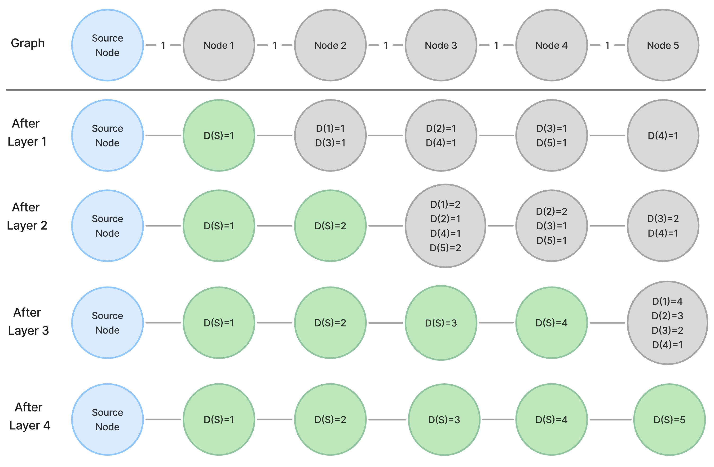
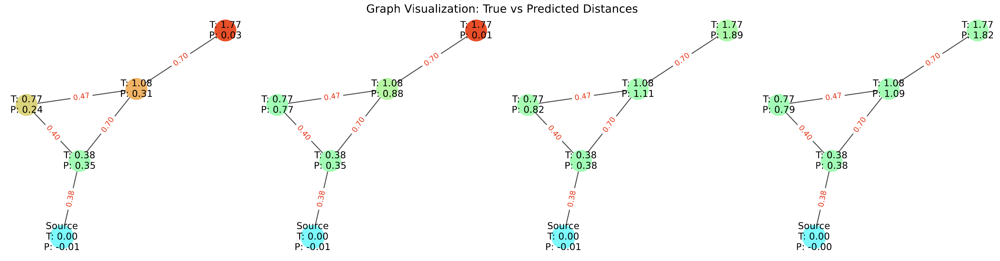

# Tokenized Graph Transformer for Single-Source Shortest Path

📄 **[Read the full report](https://drive.google.com/file/d/10nbWpSIPteXlJdt3Gf8qj4IKCWm-9b63/view?usp=sharing)**

## Abstract

We investigate adapting standard Transformer architectures for graph tasks by leveraging **TokenGT**, which encodes nodes and edges as tokens. Focusing on the **Single-Source Shortest Path (SSSP)** problem, our study systematically examines the effects of varying Transformer layers, attention heads, and training data volume. We also introduce **intermediate supervision** to enforce a hop-wise prediction process. 

Our findings show that, with appropriate configurations and sufficient data, Transformers can effectively learn graph algorithms and generalize to **out-of-distribution (OOD)** graphs—bridging the gap between Transformers and traditional graph neural networks (GNNs).

<p align="center">
  
</p>
<p align="center">
  
</p>

---

## Branch Overview

- `main`: TokenGT + MPNN experiments (layers and heads)
- `intermediate_supervision`: Experiments involving intermediate supervision
- `interm-sup-ood`: Out-of-distribution generalization experiments

---

## Getting Started

1. Create a conda environment
2. Install dependencies:
```bash
pip install -r requirements.txt
```


## Command list

Example using Hydra-Joblib parallel tasks:

```
# For MPNN experiments
python -m gnn_single_source_shortest_path.gcn_main -m --config-name config seed=1,2,3,4
# For TokenGT experiments
python -m transformers_graph_learner.graph_learner_main -m --config-name config seed=1,2,3,4

```

See hydra-joblib doc: https://hydra.cc/docs/plugins/joblib_launcher/

Evaluation can be done using the following command:
```
python -m transformers_graph_learner.graph_learner_eval
```

Experiment sweeping can be done using the following command:
```
python -m transformers_graph_learner.hypersearch_sweep
# or
python -m transformers_graph_learner.sweep
``` 
